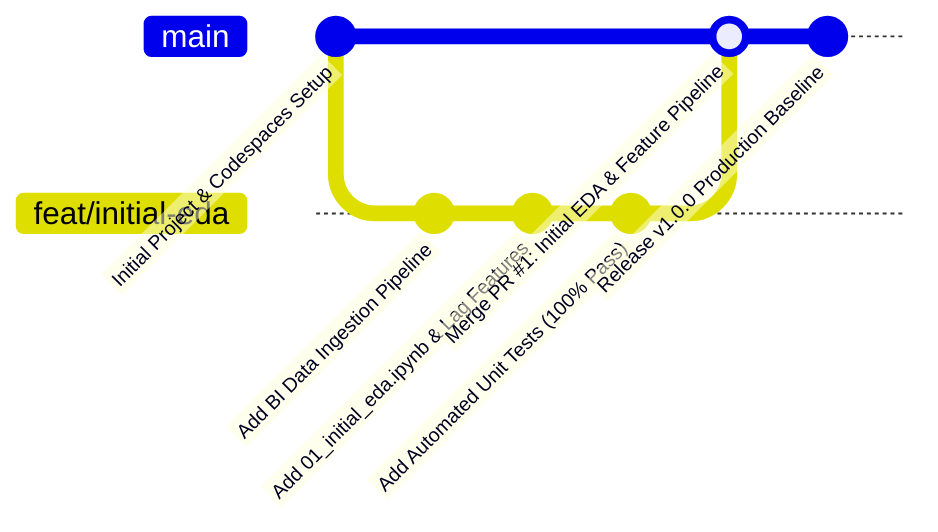

# 📈 MLOps-USD-IDR-Exchange-Rate-Prediction
### Sistem Prediksi Kurs USD/IDR Berbasis Machine Learning dengan Strategi Continual Learning dan Monitoring MLOps

[](https://codespaces.new/TOBIANDA/MLOps-USD-IDR-Exchange-Rate-Prediction)


---

## 📌 1. Deskripsi Proyek
Repositori ini berisi fondasi teknis dan implementasi pipeline **Machine Learning Operations (MLOps)** untuk peramalan deret waktu (*time-series forecasting*) nilai tukar mata uang **USD/IDR** menggunakan data resmi **Bank Indonesia Web Service**.

Proyek ini dibangun untuk memenuhi penugasan **Lembar Kerja 02 (LK-02)** pada mata kuliah **MLOps TIF-B 2026**, Fakultas Ilmu Komputer, Universitas Brawijaya.

### 👤 Identitas Pengembang
- **Nama**: Tobias Andra Valentino
- **NIM**: 245150200111076
- **Kelas**: MLOps TIF-B 2026
- **Dosen Pengampu**: Rizal Setya Perdana, S.Kom., M.Kom., Ph.D. (Email Kolaborator: `rizalespe@gmail.com`)

---

## 🚀 2. Panduan 1-Klik GitHub Codespaces (Reproducible Environment)

Proyek ini telah dikonfigurasi secara lengkap menggunakan **GitHub Codespaces** (`.devcontainer/devcontainer.json`). Lingkungan komputasi awan ini memastikan bahwa seluruh dependensi, ekstensi VS Code, dan konfigurasi port terinstalasi otomatis secara instan tanpa galat ketergantungan (*dependency error*).

### Cara Menjalankan di Codespaces:
1. Klik tombol **Open in GitHub Codespaces** di atas, atau klik tombol hijau **Code** > **Codespaces** > **Create codespace on main**.
2. Lingkungan virtual berbasis kontainer Debian Linux dengan **Python 3.11** akan otomatis terbangun.
3. Seluruh dependensi pada `requirements.txt` akan diinstalasi otomatis melalui skrip `postCreateCommand`.
4. Port `8000` (FastAPI REST API) dan `8888` (Jupyter Lab) secara otomatis di-forward.

---

## 📂 3. Struktur Direktori (Standar Cookiecutter Data Science)

Struktur repositori ini mengikuti konvensi industri Data Science dan MLOps terbaik:

```text
MLOps-USD-IDR-Exchange-Rate-Prediction/
├── .devcontainer/                  # Konfigurasi standardisasi GitHub Codespaces
│   └── devcontainer.json           # Definisi container Python 3.11 & ekstensi VS Code
├── config/                         # Konfigurasi parameter pipeline & model
│   └── config.yaml                 # Hyperparameters, paths, dan settings
├── data/                           # Data storage terstruktur
│   ├── raw/                        # Data mentah kurs BI (usd_idr_raw.csv)
│   ├── processed/                  # Data siap latih hasil feature engineering
│   └── exchange_rates.db           # SQLite database telemetri historis kurs
├── docs/                           # Dokumentasi teknis dan arsitektur
│   └── architecture.md             # Diagram alur sistem dan modul MLOps
├── models/                         # Model registry dan serialisasi artefak
│   ├── model_champion.pkl          # Model Ridge Regression terlatih
│   └── model_metadata.json         # Metadata performa & benchmark hurdle
├── notebooks/                      # Eksplorasi interaktif & eksperimen awal
│   └── 01_initial_eda.ipynb        # Analisis EDA, autokorelasi, & Random Walk baseline
├── src/                            # Source code modular produksi
│   ├── __init__.py
│   ├── ingestion/                  # Modul pengunduhan data Bank Indonesia
│   │   ├── __init__.py
│   │   └── fetcher.py
│   ├── features/                   # Pipeline rekayasa fitur (lags & rolling statistics)
│   │   ├── __init__.py
│   │   └── pipeline.py
│   ├── models/                     # Modul pelatihan, validasi, dan benchmarking
│   │   ├── __init__.py
│   │   └── trainer.py
│   └── api/                        # REST API serving microservice (FastAPI)
│       ├── __init__.py
│       └── app.py
├── tests/                          # Pengujian otomatis (Unit Testing via Pytest)
│   ├── __init__.py
│   ├── test_ingestion.py           # Validasi integritas data ingestion
│   ├── test_features.py            # Validasi zero lookahead bias pada fitur
│   ├── test_models.py              # Validasi serialisasi dan performa model
│   └── test_api.py                 # Validasi endpoint REST API
├── .gitignore                      # Python .gitignore standar
├── LICENSE                         # Lisensi Open-Source MIT
├── README.md                       # Dokumentasi utama proyek
└── requirements.txt                # Daftar dependensi produksi & pengujian
```

---

## 🌿 4. Strategi Pengelolaan Kode (GitHub Flow)

Proyek ini menerapkan alur kerja **GitHub Flow** secara disiplin:



1. **Branch `main`**: Branch utama yang selalu siap rilis (*production-ready*) dan terproteksi.
2. **Branch Fitur (`feat/initial-eda`)**: Dibuat khusus untuk eksperimen awal, data ingestion Bank Indonesia, analisis EDA, dan pembentukan feature pipeline.
3. **Validasi Sebelum Penggabungan**: Seluruh unit test pada `tests/` wajib lolos 100% sebelum merge.
4. **Pull Request & Merge**: Branch `feat/initial-eda` digabungkan ke `main` menggunakan metode *Pull Request* disertai deskripsi perubahan yang komprehensif.

---

## 💻 5. Panduan Menjalankan Proyek Secara Lokal

Jika ingin menjalankan proyek di komputer lokal:

### 1. Kloning Repositori
```bash
git clone https://github.com/TOBIANDA/MLOps-USD-IDR-Exchange-Rate-Prediction.git
cd MLOps-USD-IDR-Exchange-Rate-Prediction
```

### 2. Buat Virtual Environment & Install Dependensi
```bash
python -m venv .venv
# Aktifkan environment (Windows)
.venv\Scripts\activate
# Aktifkan environment (Linux/macOS)
source .venv/bin/activate

pip install --upgrade pip
pip install -r requirements.txt
```

### 3. Jalankan Pengujian Otomatis (Unit Testing)
```bash
pytest tests/ -v
```

### 4. Pelatihan Model & Evaluasi Benchmark
```bash
python -m src.models.trainer
```

### 5. Jalankan FastAPI Serving Server
```bash
python -m uvicorn src.api.app:app --host 0.0.0.0 --port 8000 --reload
```
Akses dokumentasi interaktif Swagger UI di browser: `http://127.0.0.1:8000/docs`.

---

## 📊 6. Metrik Evaluasi & Benchmark Random Walk

Sesuai *Efficient Market Hypothesis* (EMH), model Machine Learning wajib dievaluasi terhadap standar industri finansial:
- **Baseline 1 (Naive Random Walk)**: $y_{t+1} = y_t$
- **Baseline 2 (Rolling 7-Day Moving Average)**: $y_{t+1} = \frac{1}{7} \sum_{i=0}^6 y_{t-i}$
- **Candidate ML Model**: Ridge Regression dengan L2 regularization dan fitur momentum autoregresif.

---

## ✉️ 7. Undangan Kolaborator Dosen
Untuk transparansi monitoring berkala:
1. Masuk ke tab **Settings** repositori GitHub.
2. Pilih menu **Collaborators** > **Add people**.
3. Masukkan email dosen pengampu: `rizalespe@gmail.com` dan kirim undangan kolaborasi.
