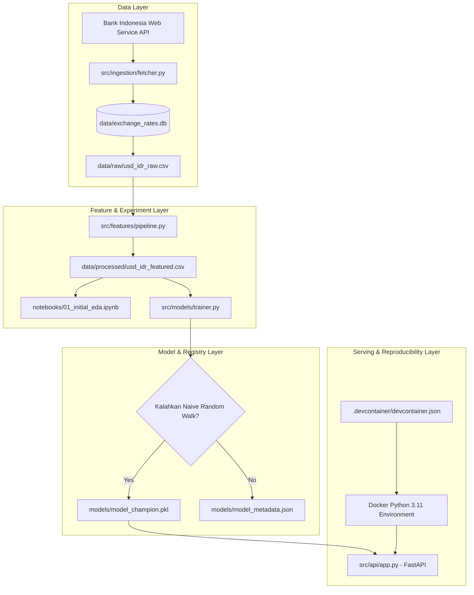

# Arsitektur Teknis MLOps — Prediksi Kurs USD/IDR

Dokumen ini mendokumentasikan fondasi teknis, topologi pipeline, dan arsitektur reproducibility untuk sistem prediksi nilai tukar mata uang asing (USD/IDR) berbasis Bank Indonesia Web Service.

## 1. Prinsip Reproducibility
- **Lingkungan Standar**: Menggunakan GitHub Codespaces (`.devcontainer/devcontainer.json`) dengan base image Python 3.11 dan instalasi otomatis seluruh dependensi `requirements.txt`.
- **Zero Lookahead Bias**: Seluruh feature engineering (lag dan rolling window) dikomputasi strictly terhadap observasi masa lalu ($t-1$), mencegah terjadinya data leakage pada time-series cross-validation.
- **Konvensi Cookiecutter Data Science**: Pemisahan jelas antara konfigurasi (`config/`), data (`data/`), model terlatih (`models/`), notebook eksperimen (`notebooks/`), kode modular produksi (`src/`), dan pengujian otomatis (`tests/`).
